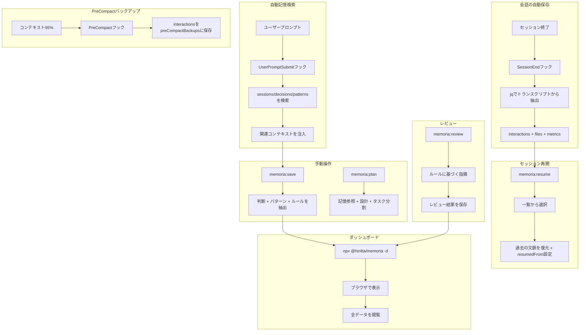

# memoria

Claude Codeの長期記憶を実現するプラグイン

セッションの自動保存、インテリジェントな記憶検索、Webダッシュボードでの管理を提供します。

## 機能

### コア機能
- **会話の自動保存**: セッション終了時にjqで自動保存（確実・高速）
- **自動記憶検索**: プロンプトごとに関連する過去のセッション・判断を自動で注入
- **PreCompactバックアップ**: Auto-Compact前にinteractionsをバックアップ（コンテキスト95%で発動）
- **フルデータ抽出**: `/memoria:save` で要約・判断・パターン・ルールを一括保存
- **記憶参照プランニング**: `/memoria:plan` で過去の知見を活用した設計・計画
- **セッション再開**: `/memoria:resume` で過去のセッションを再開（チェーン追跡付き）
- **セッション提案**: セッション開始時に最新3件を提案
- **ルールベースレビュー**: `dev-rules.json` / `review-guidelines.json` に基づくレビュー
- **GitHub PRレビュー**: `/memoria:review <PR URL>` でGitHub PRをレビュー
- **知見の抽出**: `/memoria:harvest` でPRコメントからルール・パターンを抽出
- **週次レポート**: レビュー結果を集計したMarkdownレポートを自動生成
- **Webダッシュボード**: セッション・判断・パターン・ルールの閲覧

## 課題と解決（導入メリット）

### Claude Code 開発で起きがちな課題

- **コンテキストの消失**: セッション終了やAuto-Compactで会話の文脈が失われる
- **判断の不透明化**: 「なぜこの設計にしたのか」が後から追えない
- **同じミスの繰り返し**: 同じエラーを何度も解決（学習されない）
- **知見の再利用が難しい**: 過去のやり取りや決定を検索・参照しづらい

### memoria でできること

- **自動保存 + 再開**で、セッションを跨いだ文脈の継続が可能
- **自動記憶検索**で、関連する過去の知見が常に会話に反映される
- **判断・パターン記録**で、理由やエラー解決策を後から追跡
- **検索とダッシュボード**で、過去の記録を素早く参照
- **レビュー機能**で、リポジトリ固有の観点に基づいて指摘

### チーム利用のメリット

- `.memoria/` のJSONファイルは**Git管理可能**なので、判断や会話の履歴をチームで共有できる
- オンボーディングやレビュー時に「背景・経緯」を短時間で把握できる

## インストール

### 前提条件

- **jq**: フックでJSON処理に使用します

```bash
# macOS
brew install jq

# Ubuntu/Debian
sudo apt-get install jq

# Windows (Chocolatey)
choco install jq

# Windows (Scoop)
scoop install jq

# Windows (winget)
winget install jqlang.jq
```

### プラグインのインストール

Claude Code内で以下を実行

```bash
/plugin marketplace add hir4ta/memoria-marketplace
/plugin install memoria@memoria-marketplace
```

Claude Codeを再起動して完了

## アップデート

Claude Code内で以下を実行

```bash
/plugin marketplace update memoria-marketplace
```

Claude Codeを再起動

### 自動更新を有効にする（推奨）

1. `/plugin` を実行
2. Marketplaces タブを選択
3. `memoria-marketplace` を選択
4. "Enable auto-update" を有効化

これによりClaude Code起動時に自動でアップデートされます

## 使い方

### セッション自動保存

**会話ログは自動保存**されます（セッション終了時にjqで抽出）。設定不要。

**PreCompact**ではinteractionsを`preCompactBackups`にバックアップします（コンテキスト95%で発動）。要約は自動作成されません。

### 自動記憶検索

**プロンプトごとに**、memoriaは自動で：
1. メッセージからキーワードを抽出
2. sessions/decisions/patternsを検索
3. 関連情報をClaudeに注入

手動で検索しなくても、過去の知見が常に活用されます。

### セッション提案

セッション開始時に最新3件が表示されます：

```
**Recent sessions:**
  1. [abc123] JWT認証の実装 (2026-01-27, main)
  2. [def456] ダッシュボードUI (2026-01-26, main)
  3. [ghi789] バグ修正 (2026-01-25, main)

Continue from a previous session? Use `/memoria:resume <id>`
```

### コマンド

| コマンド | 説明 |
| --------- | ------ |
| `/memoria:save` | 全データ抽出: 要約・判断・パターン・ルール |
| `/memoria:plan [トピック]` | 記憶参照 + ソクラティック質問 + タスク分割 |
| `/memoria:resume [id]` | セッションを再開（ID省略で一覧表示） |
| `/memoria:search "クエリ"` | セッション・判断・パターンを検索 |
| `/memoria:review [--staged\|--all\|--diff=branch\|--full]` | ルールに基づくレビュー |
| `/memoria:review <PR URL>` | GitHub PRをレビュー |
| `/memoria:harvest <PR URL>` | PRレビューコメントから知見を抽出 |
| `/memoria:report [--from YYYY-MM-DD --to YYYY-MM-DD]` | 週次レビューレポート |

### 推奨ワークフロー

```
plan → implement → save → review
```

1. **plan**: 記憶参照 + ソクラティック質問 + タスク分割
2. **implement**: 計画に沿って実装
3. **save**: 判断・パターン・ルールを抽出
4. **review**: 計画準拠とコード品質をレビュー

### ダッシュボード

プロジェクトディレクトリで以下を実行

```bash
npx @hir4ta/memoria --dashboard
```

ブラウザで <http://localhost:7777> を開く。

ポート変更:

```bash
npx @hir4ta/memoria --dashboard --port 8080
```

#### 画面一覧

- **Sessions**: セッション一覧・詳細
- **Decisions**: 技術的な判断の一覧・詳細
- **Rules**: 開発ルール・レビュー観点の閲覧
- **Patterns**: 学習済みパターンの閲覧（グッドパターン、アンチパターン、エラー解決策）
- **Statistics**: アクティビティチャート・セッション統計の表示
- **Graph**: タグ共有によるセッション関連性の可視化

#### 言語切り替え

ダッシュボードは日本語と英語に対応しています。ヘッダーの言語切り替えボタン（EN/JA）をクリックして切り替えできます。設定はlocalStorageに保存されます。

## 仕組み



## データ保存

すべてのデータは `.memoria/` ディレクトリに保存

```text
.memoria/
├── tags.json         # タグマスターファイル（93タグ、表記揺れ防止）
├── sessions/         # セッション履歴（自動 + 手動保存）
│   └── YYYY/MM/
│       └── {id}.json
├── decisions/        # 技術的な判断（/saveから）
│   └── YYYY/MM/
│       └── {id}.json
├── patterns/         # エラーパターン（/saveから）
│   └── {user}.json
├── rules/            # 開発ルール / レビュー観点
├── reviews/          # レビュー結果 (YYYY/MM)
└── reports/          # 週次レポート (YYYY-MM)
```

Gitでバージョン管理可能です。`.gitignore` に追加するかはプロジェクトに応じて判断してください。

### セッションJSONスキーマ

全てのセッションデータは単一のJSONファイルに保存されます：

```json
{
  "id": "abc12345",
  "sessionId": "claude-code-からの-full-uuid",
  "createdAt": "2026-01-27T10:00:00Z",
  "endedAt": "2026-01-27T12:00:00Z",
  "title": "JWT認証機能の実装",
  "tags": ["auth", "jwt"],
  "context": {
    "branch": "feature/auth",
    "projectDir": "/path/to/project",
    "user": { "name": "tanaka", "email": "tanaka@example.com" }
  },
  "interactions": [
    {
      "id": "int-001",
      "timestamp": "2026-01-27T10:15:00Z",
      "user": "認証機能を実装して",
      "thinking": "思考プロセスの重要なポイント",
      "assistant": "RS256署名でJWT認証を実装しました"
    }
  ],
  "metrics": {
    "userMessages": 5,
    "assistantResponses": 5,
    "thinkingBlocks": 5,
    "toolUsage": [{"name": "Edit", "count": 3}, {"name": "Write", "count": 2}]
  },
  "files": [
    { "path": "src/auth/jwt.ts", "action": "create" }
  ],
  "preCompactBackups": [],
  "resumedFrom": "def45678",
  "status": "complete",

  "summary": {
    "title": "JWT認証機能の実装",
    "goal": "JWTベースの認証機能を実装",
    "outcome": "success",
    "description": "RS256署名でJWT認証を実装",
    "sessionType": "implementation"
  },

  "plan": {
    "tasks": ["[x] JWT署名方式の選定", "[x] ミドルウェア実装", "[ ] テスト追加"],
    "remaining": ["テスト追加"]
  },

  "discussions": [
    {
      "topic": "署名方式",
      "decision": "RS256を採用",
      "reasoning": "本番環境でのセキュリティを考慮",
      "alternatives": ["HS256（シンプルだが秘密鍵共有が必要）"]
    }
  ],

  "errors": [
    {
      "error": "secretOrPrivateKey must be asymmetric",
      "cause": "HS256用の秘密鍵をRS256で使用",
      "solution": "RS256用のキーペアを生成"
    }
  ],

  "handoff": {
    "stoppedReason": "テスト作成は次回に持ち越し",
    "notes": ["vitest設定済み", "モック用のキーペアは test/fixtures/ に配置"],
    "nextSteps": ["jwt.test.ts を作成", "E2Eテスト追加"]
  },

  "references": [
    { "url": "https://jwt.io/introduction", "title": "JWT Introduction" }
  ]
}
```

### セッションタイプ

`sessionType` フィールドはセッションの種類を分類します。

| タイプ | 説明 |
|--------|------|
| `decision` | 決定サイクルあり（設計判断、技術選択など） |
| `implementation` | コード変更あり |
| `research` | リサーチ・学習・キャッチアップ |
| `exploration` | コードベース探索 |
| `discussion` | 議論・相談のみ |
| `debug` | デバッグ・調査 |
| `review` | コードレビュー |

### タグ

タグは `.memoria/tags.json` から選択され、表記揺れを防止します（例: 「フロント」→「frontend」）。マスターファイルには11カテゴリ93タグが含まれています：

- **domain**: frontend, backend, api, db, infra, mobile, cli
- **phase**: feature, bugfix, refactor, test, docs
- **ai**: llm, ai-agent, mcp, rag, vector-db, embedding
- **cloud**: serverless, microservices, edge, wasm
- その他...

## ライセンス

MIT
