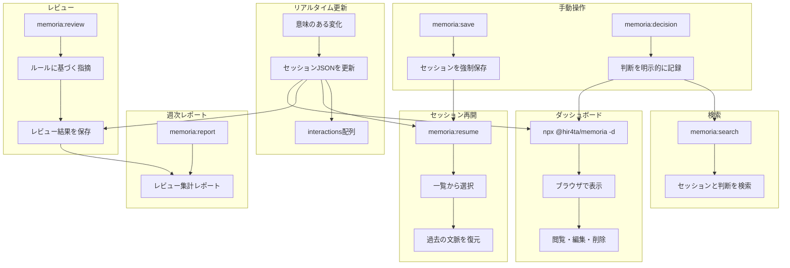

# memoria

Claude Codeの長期記憶を実現するプラグイン

セッションのリアルタイム保存、技術的な判断の記録、Webダッシュボードでの管理を提供します。

## 機能

- **リアルタイムセッション更新**: 意味のある変化があった時にセッションJSONを自動更新
- **セッション再開**: `/memoria:resume` で過去のセッションを再開
- **技術的な判断の記録**: `/memoria:decision` で判断を記録
- **ルールベースレビュー**: `dev-rules.json` / `review-guidelines.json` に基づくレビュー
- **週次レポート**: レビュー結果を集計したMarkdownレポートを自動生成
- **Webダッシュボード**: セッション・判断記録の閲覧・編集

## 課題と解決（導入メリット）

### Claude Code 開発で起きがちな課題

- **コンテキストの消失**: セッション終了やAuto-Compactで会話の文脈が失われる
- **判断の不透明化**: 「なぜこの設計にしたのか」が後から追えない
- **知見の再利用が難しい**: 過去のやり取りや決定を検索・参照しづらい

### memoria でできること／解消できること

- **リアルタイム保存 + 再開**で、セッションを跨いだ文脈の継続が可能
- **判断記録**で、理由・代替案を後から追跡
- **検索とダッシュボード**で、過去の記録を素早く参照
- **レビュー機能**で、リポジトリ固有の観点に基づいて指摘
- **週次レポート**で、レビュー観点の改善と共有が容易

### チーム利用のメリット

- `.memoria/` のJSONは**Git管理可能**なので、判断や会話の履歴をチームで共有できる
- オンボーディングやレビュー時に「背景・経緯」を短時間で把握できる

## インストール

### 前提条件

- **jq**: フックでJSON処理に使用します

```bash
# macOS
brew install jq

# Ubuntu/Debian
sudo apt-get install jq

# Windows (Chocolatey)
choco install jq

# Windows (Scoop)
scoop install jq

# Windows (winget)
winget install jqlang.jq
```

### プラグインのインストール

Claude Code内で以下を実行

```bash
/plugin marketplace add hir4ta/memoria-marketplace
/plugin install memoria@memoria-marketplace
```

Claude Codeを再起動して完了

## アップデート

Claude Code内で以下を実行

```bash
/plugin marketplace update memoria-marketplace
```

Claude Codeを再起動

### 自動更新を有効にする（推奨）

1. `/plugin` を実行
2. Marketplaces タブを選択
3. `memoria-marketplace` を選択
4. "Enable auto-update" を有効化

これによりClaude Code起動時に自動でアップデートされます

## 使い方

### 自動動作

| タイミング | 動作 |
| ----------- | ------ |
| セッション開始時 | セッションJSONを初期化、関連セッションの提案 |
| 会話中 | 意味のある変化があった時にセッションJSONを更新 |
| セッション終了時 | フォールバック処理（未更新の場合）、クリーンアップ |

### コマンド

| コマンド | 説明 |
| --------- | ------ |
| `/memoria:resume [id]` | セッションを再開（ID省略で一覧表示） |
| `/memoria:save` | 現在のセッションを強制保存 |
| `/memoria:decision "タイトル"` | 技術的な判断を記録 |
| `/memoria:search "クエリ"` | セッション・判断記録を検索 |
| `/memoria:review [--staged|--all|--diff=branch]` | ルールに基づくレビュー |
| `/memoria:report [--from YYYY-MM-DD --to YYYY-MM-DD]` | 週次レビューレポート |

### ダッシュボード

プロジェクトディレクトリで以下を実行

```bash
npx @hir4ta/memoria --dashboard
```

ブラウザで <http://localhost:7777> を開く。

ポート変更:

```bash
npx @hir4ta/memoria --dashboard --port 8080
```

#### 画面一覧

- **Sessions**: セッション一覧・詳細・編集・削除
- **Decisions**: 技術的な判断の一覧・作成・編集・削除
- **Rules**: 開発ルール・レビュー観点の閲覧・編集

## 仕組み



## データ保存

すべてのデータは `.memoria/` ディレクトリにJSON形式で保存

```text
.memoria/
├── tags.json         # タグマスターファイル（93タグ、表記揺れ防止）
├── sessions/         # セッション履歴 (YYYY/MM)
├── decisions/        # 技術的な判断 (YYYY/MM)
├── rules/            # 開発ルール / レビュー観点
├── reviews/          # レビュー結果 (YYYY/MM)
└── reports/          # 週次レポート (YYYY-MM)
```

Gitでバージョン管理可能です。`.gitignore` に追加するかはプロジェクトに応じて判断してください。

### セッションJSONスキーマ

セッションは **interactions ベース** のスキーマを使用します。各 interaction は決定サイクル（リクエスト → 思考 → 提案 → 選択 → 実装）を表します。

```json
{
  "id": "2026-01-27_abc123",
  "sessionId": "claude-code-からの-full-uuid",
  "createdAt": "2026-01-27T10:00:00Z",
  "context": {
    "branch": "feature/auth",
    "projectDir": "/path/to/project",
    "user": { "name": "tanaka", "email": "tanaka@example.com" }
  },
  "title": "JWT認証機能の実装",
  "goal": "JWTベースの認証機能を実装し、リフレッシュトークンにも対応する",
  "tags": ["auth", "jwt", "backend"],
  "interactions": [
    {
      "id": "int-001",
      "topic": "認証方式の選択",
      "timestamp": "2026-01-27T10:15:00Z",
      "request": "認証機能を実装したい",
      "thinking": "JWTとセッションCookieを比較...",
      "webLinks": ["https://jwt.io/introduction"],
      "proposals": [
        { "option": "JWT", "description": "ステートレス、スケーラブル" },
        { "option": "セッションCookie", "description": "シンプル" }
      ],
      "choice": "JWT",
      "reasoning": "マイクロサービス間の認証共有が容易",
      "actions": [
        { "type": "create", "path": "src/auth/jwt.ts", "summary": "JWTモジュール" }
      ],
      "filesModified": ["src/auth/jwt.ts"]
    }
  ]
}
```

### 更新トリガー

Claude Code は意味のある変化があった時にセッションJSONを更新します：

| トリガー | 更新内容 |
|---------|---------|
| セッションの目的が明確になった | `title`, `goal` |
| ユーザーの指示に対応した | `interactions` に追加 |
| 技術的決定を下した | `proposals`, `choice`, `reasoning` |
| エラーに遭遇・解決した | `problem`, `choice`, `reasoning` |
| ファイルを変更した | `actions`, `filesModified` |
| URLを参照した | `webLinks` |
| 新しいキーワードが出現 | `tags`（tags.jsonを参照） |

### タグ

タグは `.memoria/tags.json` から選択され、表記揺れを防止します（例: 「フロント」→「frontend」）。マスターファイルには11カテゴリ93タグが含まれています：

- **domain**: frontend, backend, api, db, infra, mobile, cli
- **phase**: feature, bugfix, refactor, test, docs
- **ai**: llm, ai-agent, mcp, rag, vector-db, embedding
- **cloud**: serverless, microservices, edge, wasm
- その他...

## ライセンス

MIT
