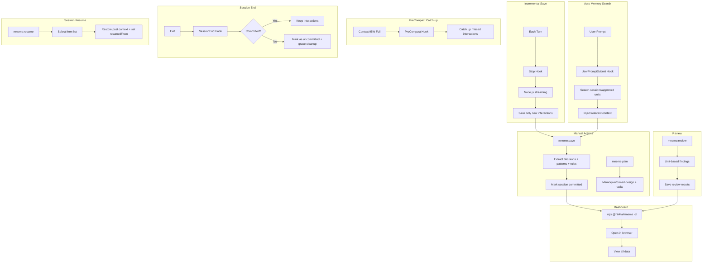

# mneme

[](https://www.npmjs.com/package/@hir4ta/mneme)
[](https://github.com/hir4ta/mneme/blob/main/LICENSE)

Long-term memory plugin for Claude Code

Provides automatic session saving, intelligent memory search, and web dashboard management.

## Features

### Core Features

- **Incremental save**: Save only new interactions on each turn completion (Node.js, fast)
- **Auto memory search**: Related past sessions/decisions automatically injected on each prompt
- **PreCompact support**: Catch up unsaved interactions before Auto-Compact (context 95% full)
- **Full data extraction**: Save summary, decisions, patterns, and rules with `/mneme:save`
- **Memory-informed planning**: Design and plan with past knowledge via `/mneme:plan`
- **Session Resume**: Resume past sessions with `/mneme:resume` (with chain tracking)
- **Session Suggestion**: Recent 3 sessions shown at session start
- **Unit-based Review**: Code review based on approved units
- **GitHub PR Review**: Review GitHub PRs with `/mneme:review <PR URL>`
- **Knowledge Harvesting**: Extract decision/pattern/rule sources from PR comments with `/mneme:harvest`
- **Web Dashboard**: View sessions, source artifacts, and units
- **Units + Approval Queue**: Generate unified units and review them with approve/reject workflow
- **Knowledge Graph Layer**: Visualize sessions and approved units as one graph

## Problems Solved

### Common Issues in Claude Code Development

- **Context Loss**: Conversation context is lost on session end or Auto-Compact
- **Opaque Decisions**: "Why did we choose this design?" becomes untraceable
- **Repeated Mistakes**: Same errors solved multiple times without learning
- **Hard to Reuse Knowledge**: Past interactions and decisions are hard to search

### What mneme Enables

- **Auto-save + Resume** enables context continuity across sessions
- **Auto memory search** brings relevant past knowledge to every conversation
- **Decision & Pattern Recording** tracks reasoning and error solutions
- **Search and Dashboard** for quick access to past records
- **Review Feature** for repository-specific code review

### Team Benefits

- `.mneme/` JSON files are **Git-manageable**, enabling team sharing of decisions and session history
- Quickly understand background and context during onboarding or reviews

## Installation

### Prerequisites

> **⚠️ IMPORTANT: Node.js >= 22.5.0 Required**
>
> mneme uses the built-in `node:sqlite` module, which was introduced in **Node.js 22.5.0**.
> The dashboard will NOT work on Node.js 20 or earlier versions.
>
> Check your version: `node --version`
>
> Node.js 20 LTS ends April 2026. Please upgrade to Node.js 22 or later.

- **jq**: Used for JSON processing in hooks

```bash
# macOS
brew install jq

# Ubuntu/Debian
sudo apt-get install jq

# Windows (Chocolatey)
choco install jq

# Windows (Scoop)
scoop install jq

# Windows (winget)
winget install jqlang.jq
```

### Plugin Installation

Run the following in Claude Code:

```bash
/plugin marketplace add hir4ta/mneme-marketplace
/plugin install mneme@mneme-marketplace
```

Then initialize mneme in your project:

```bash
# In Claude Code
/init-mneme

# Or from terminal
npx @hir4ta/mneme --init
```

Restart Claude Code to complete installation.

## Update

Run the following in Claude Code:

```bash
/plugin marketplace update mneme-marketplace
```

Restart Claude Code.

### Enable Auto-Update (Recommended)

1. Run `/plugin`
2. Select Marketplaces tab
3. Select `mneme-marketplace`
4. Enable "Enable auto-update"

This will auto-update on Claude Code startup.

## Usage

### Incremental Save

**Conversation logs are auto-saved on each turn completion** (Node.js streaming). No configuration needed.

- **Stop hook**: Saves only new interactions on each assistant response completion
- **PreCompact hook**: Catches up unsaved interactions before Auto-Compact
- **SessionEnd hook**: Lightweight cleanup only (no heavy processing)

If you don't run `/mneme:save`, the session is marked as `uncommitted` and kept temporarily. By default, stale uncommitted sessions are cleaned after a 7-day grace period.

### Auto Memory Search

**On every prompt**, mneme automatically:

1. Extracts keywords from your message
2. Searches sessions/approved units
3. Injects relevant context to Claude

This means past knowledge is always available without manual lookup.

### Session Suggestion

At session start, recent 3 sessions are shown:

```
**Recent sessions:**
  1. [abc123] JWT authentication implementation (2026-01-27, main)
  2. [def456] Dashboard UI improvements (2026-01-26, main)
  3. [ghi789] Bug fixes (2026-01-25, main)

Continue from a previous session? Use `/mneme:resume <id>`
```

### Commands

| Command                                                  | Description                                                  |
| -------------------------------------------------------- | ------------------------------------------------------------ |
| `/init-mneme`                                            | Initialize mneme in current project                          |
| `/mneme:save`                                            | Extract all data: summary, decisions, patterns, rules        |
| `/mneme:plan [topic]`                                    | Memory-informed design + Socratic questions + task breakdown |
| `/mneme:resume [id]`                                     | Resume session (show list if ID omitted)                     |
| `/mneme:search "query"`                                  | Search sessions and approved units                           |
| `/mneme:review [--staged\|--all\|--diff=branch\|--full]` | Unit-based code review                                       |
| `/mneme:review <PR URL>`                                 | Review GitHub PR                                             |
| `/mneme:harvest <PR URL>`                                | Extract knowledge from PR review comments                    |

### Recommended Workflow

```
plan → implement → save → review
```

1. **plan**: Design with memory lookup + Socratic questions + task breakdown
2. **implement**: Follow the plan
3. **save**: Extract source knowledge and refresh units
4. **validate**: Run `npm run validate:sources` to enforce required fields/priority/tags
5. **review**: Verify against plan and approved units

Detailed runtime flow (hooks, uncommitted policy, auto-compact path):
- `docs/mneme-runtime-flow.md`

### Weekly Knowledge HTML Export

Generate a shareable HTML snapshot for the last 7 days of knowledge activity:

```bash
npm run export:weekly-html
```

Output:
- `.mneme/exports/weekly-knowledge-YYYY-MM-DD.html`

### Dashboard

Run in your project directory:

```bash
npx @hir4ta/mneme --dashboard
```

Open <http://localhost:7777> in your browser.

Change port:

```bash
npx @hir4ta/mneme --dashboard --port 8080
```

#### Screens

- **Sessions**: List and view sessions
- **Decisions**: List and view technical decisions
- **Rules**: View dev rules and review guidelines
- **Patterns**: View learned patterns (good patterns, anti-patterns, error solutions)
- **Statistics**: View activity charts and session statistics
- **Graph**: Visualize session connections by shared tags
- **Units**: Review pending units and approve/reject/delete

#### Language Switching

The dashboard supports English and Japanese. Click the language toggle (EN/JA) in the header to switch. The preference is saved to localStorage.

### MCP Tools

mneme provides MCP servers with search and database tools callable directly from Claude Code:

| Server       | Tool                                | Description                                      |
| ------------ | ----------------------------------- | ------------------------------------------------ |
| mneme-search | `mneme_search`                      | Unified search (FTS5, tag alias resolution)      |
| mneme-search | `mneme_get_session`                 | Get session details                              |
| mneme-search | `mneme_get_unit`                    | Get unit details                                 |
| mneme-db     | `mneme_list_projects`               | List all projects                                |
| mneme-db     | `mneme_list_sessions`               | List sessions                                    |
| mneme-db     | `mneme_get_interactions`            | Get interactions for a session                   |
| mneme-db     | `mneme_stats`                       | Aggregate stats                                  |
| mneme-db     | `mneme_cross_project_search`        | Cross-project search                             |
| mneme-db     | `mneme_unit_queue_list_pending`     | List pending unit approvals                      |
| mneme-db     | `mneme_unit_queue_update_status`    | Approve/reject/pending in bulk                   |
| mneme-db     | `mneme_unit_apply_suggest_for_diff` | Suggest units for diff review                    |
| mneme-db     | `mneme_unit_apply_explain_match`    | Explain unit-to-diff match                       |
| mneme-db     | `mneme_session_timeline`            | Build timeline/session chain context             |
| mneme-db     | `mneme_rule_linter`                 | Lint rule quality and required fields            |
| mneme-db     | `mneme_graph_insights`              | Central units, communities, orphan units         |
| mneme-db     | `mneme_search_eval`                 | Run/compare search benchmark                     |
| mneme-db     | `mneme_audit_query`                 | Query unit audit history                         |

### Subagents

| Agent            | Description                               |
| ---------------- | ----------------------------------------- |
| `mneme-reviewer` | Unit-based code review (isolated context) |

## How It Works



## Data Storage

mneme uses a **hybrid storage** approach for privacy and collaboration:

| Storage    | Location          | Purpose                               | Sharing                   |
| ---------- | ----------------- | ------------------------------------- | ------------------------- |
| **JSON**   | `.mneme/`         | Summaries, decisions, patterns, rules | Git-managed (team shared) |
| **SQLite** | `.mneme/local.db` | Interactions, backups                 | Local only (gitignored)   |

**Why hybrid?**

- **Privacy**: Conversation history (interactions) stays local (gitignored)
- **Lightweight**: JSON files reduced from 100KB+ to ~5KB (interactions excluded)
- **Future-ready**: Embeddings table prepared for semantic search

### Directory Structure

**Project-local (`.mneme/`)**:

```text
.mneme/
├── local.db          # SQLite with interactions (gitignored)
├── tags.json         # Tag master file (93 tags, prevents notation variations)
├── sessions/         # Session metadata (YYYY/MM) - Git-managed
│   └── YYYY/MM/
│       └── {id}.json # Metadata only (interactions in local.db)
├── decisions/        # Technical decisions (from /save) - Git-managed
│   └── YYYY/MM/
│       └── {id}.json
├── patterns/         # Error patterns (from /save) - Git-managed
│   └── {user}.json
├── rules/            # Dev rules / review guidelines - Git-managed
├── reviews/          # Review results (YYYY/MM) - Git-managed
└── audit/            # Audit logs (JSONL)
```

The `local.db` file is automatically added to `.mneme/.gitignore` to keep conversations private.

### Session JSON Schema

Session metadata is stored in JSON (interactions are stored in SQLite for privacy):

```json
{
  "id": "abc12345",
  "sessionId": "full-uuid-from-claude-code",
  "createdAt": "2026-01-27T10:00:00Z",
  "endedAt": "2026-01-27T12:00:00Z",
  "title": "JWT authentication implementation",
  "tags": ["auth", "jwt"],
  "context": {
    "branch": "feature/auth",
    "projectDir": "/path/to/project",
    "user": { "name": "tanaka", "email": "tanaka@example.com" }
  },
  "metrics": {
    "userMessages": 5,
    "assistantResponses": 5,
    "thinkingBlocks": 5,
    "toolUsage": [
      { "name": "Edit", "count": 3 },
      { "name": "Write", "count": 2 }
    ]
  },
  "files": [{ "path": "src/auth/jwt.ts", "action": "create" }],
  "resumedFrom": "def45678",
  "status": "complete",

  "summary": {
    "title": "JWT authentication implementation",
    "goal": "Implement JWT-based auth with refresh token support",
    "outcome": "success",
    "description": "Implemented JWT auth with RS256 signing",
    "sessionType": "implementation"
  },

  "plan": {
    "tasks": [
      "[x] JWT signing method selection",
      "[x] Middleware implementation",
      "[ ] Add tests"
    ],
    "remaining": ["Add tests"]
  },

  "discussions": [
    {
      "topic": "Signing algorithm",
      "decision": "Adopt RS256",
      "reasoning": "Security considerations for production",
      "alternatives": ["HS256 (simpler but requires shared secret)"]
    }
  ],

  "errors": [
    {
      "error": "secretOrPrivateKey must be asymmetric",
      "cause": "Using HS256 secret with RS256",
      "solution": "Generate RS256 key pair"
    }
  ],

  "handoff": {
    "stoppedReason": "Test creation postponed to next session",
    "notes": ["vitest configured", "Mock key pair in test/fixtures/"],
    "nextSteps": ["Create jwt.test.ts", "Add E2E tests"]
  },

  "references": [
    { "url": "https://jwt.io/introduction", "title": "JWT Introduction" }
  ]
}
```

### Session Types

The `sessionType` field classifies the session type.

| Type             | Description                                             |
| ---------------- | ------------------------------------------------------- |
| `decision`       | Decision cycle present (design choices, tech selection) |
| `implementation` | Code changes made                                       |
| `research`       | Research, learning, catchup                             |
| `exploration`    | Codebase exploration                                    |
| `discussion`     | Discussion, consultation only                           |
| `debug`          | Debugging, investigation                                |
| `review`         | Code review                                             |

### Tags

Tags are selected from `.mneme/tags.json` to prevent notation variations (e.g., "フロント" → "frontend"). The master file contains 93 tags across 11 categories:

- **domain**: frontend, backend, api, db, infra, mobile, cli
- **phase**: feature, bugfix, refactor, test, docs
- **ai**: llm, ai-agent, mcp, rag, vector-db, embedding
- **cloud**: serverless, microservices, edge, wasm
- And more...

## Security and Privacy

mneme operates **entirely locally** with no data sent to external servers.

| Item                       | Description                                                         |
| -------------------------- | ------------------------------------------------------------------- |
| **External Communication** | None - no curl/fetch/HTTP requests are made                         |
| **Data Storage**           | All data stored in project's `.mneme/` directory                    |
| **Conversation History**   | Stored in `local.db`, automatically gitignored (not shared via Git) |
| **Tools Used**             | bash, Node.js, jq, sqlite3 (no external dependencies)               |
| **Code**                   | Open source - all code is auditable                                 |

### Privacy by Design

- **Conversations (interactions) are local-only**: Stored in SQLite (`local.db`), auto-added to `.gitignore`
- **Only metadata is Git-shareable**: Session summaries, decisions, patterns can be shared with team via JSON
- **No telemetry**: No usage tracking or external data transmission

## License

MIT
