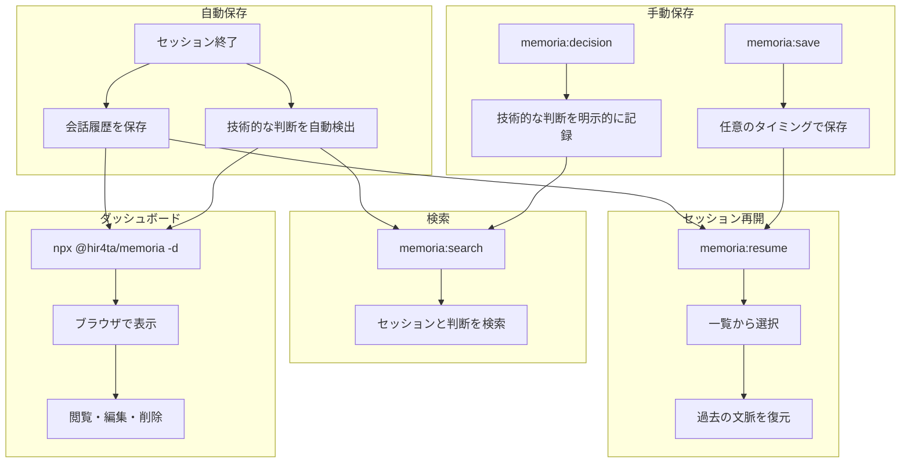

# memoria

Claude Codeの長期記憶を実現するプラグイン

セッションの自動保存、技術的な判断の記録、Webダッシュボードでの管理を提供します

## 機能

- **セッション自動保存**: セッション終了時・圧縮前に会話履歴を自動保存
- **セッション再開**: `/memoria:resume` で過去のセッションを再開
- **技術的な判断の記録**: セッション終了時に自動検出・保存（手動記録も可能）
- **Webダッシュボード**: セッション・判断記録の閲覧・編集

## インストール

### 前提条件

- **jq**: フックでJSON処理に使用します

```bash
# macOS
brew install jq

# Ubuntu/Debian
sudo apt-get install jq

# Windows (Chocolatey)
choco install jq

# Windows (Scoop)
scoop install jq

# Windows (winget)
winget install jqlang.jq
```

### プラグインのインストール

Claude Code内で以下を実行

```bash
/plugin marketplace add hir4ta/memoria-marketplace
/plugin install memoria@memoria-marketplace
```

Claude Codeを再起動して完了

## アップデート

Claude Code内で以下を実行

```bash
/plugin marketplace update memoria-marketplace
```

Claude Codeを再起動

### 自動更新を有効にする（推奨）

1. `/plugin` を実行
2. Marketplaces タブを選択
3. `memoria-marketplace` を選択
4. "Enable auto-update" を有効化

これによりClaude Code起動時に自動でアップデートされます

## 使い方

### 自動動作

| タイミング | 動作 |
| ----------- | ------ |
| セッション開始時 | 関連セッションの提案 |
| セッション終了時 | 会話履歴を保存、技術的な判断を自動検出 |
| 圧縮前 | 進行中のセッションを保存 |

### コマンド

| コマンド | 説明 |
| --------- | ------ |
| `/memoria:resume [id]` | セッションを再開（ID省略で一覧表示） |
| `/memoria:save` | 現在のセッションを手動保存 |
| `/memoria:decision "タイトル"` | 技術的な判断を記録 |
| `/memoria:search "クエリ"` | セッション・判断記録を検索 |

### ダッシュボード

プロジェクトディレクトリで以下を実行

```bash
npx @hir4ta/memoria --dashboard
```

ブラウザで <http://localhost:7777> を開く。

ポート変更:

```bash
npx @hir4ta/memoria --dashboard --port 8080
```

#### 画面一覧

- **Sessions**: セッション一覧・詳細・編集・削除
- **Decisions**: 技術的な判断の一覧・作成・編集・削除

## 仕組み



## データ保存

すべてのデータは `.memoria/` ディレクトリにJSON形式で保存

```text
.memoria/
├── sessions/       # セッション履歴
└── decisions/      # 技術的な判断
```

Gitでバージョン管理可能です。`.gitignore` に追加するかはプロジェクトに応じて判断してください。

## ライセンス

MIT
