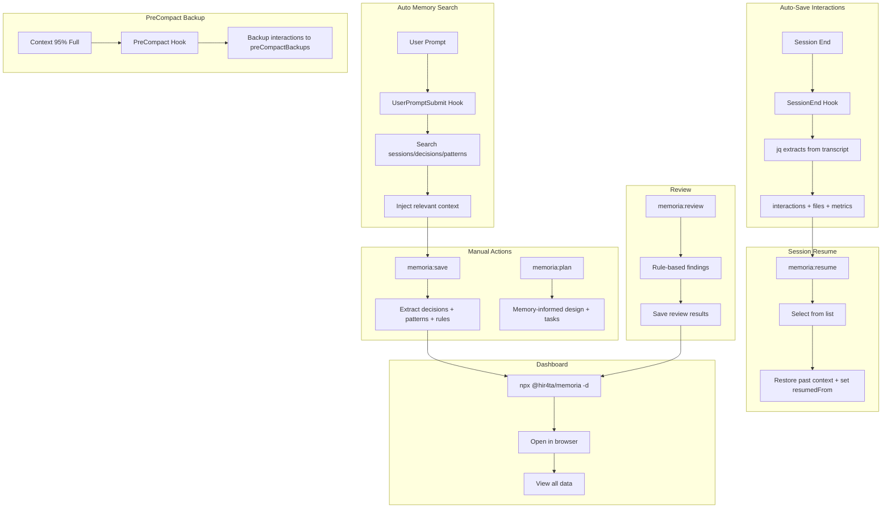

# memoria

Long-term memory plugin for Claude Code

Provides automatic session saving, intelligent memory search, and web dashboard management.

## Features

### Core Features
- **Auto-save interactions**: Conversations auto-saved at session end (jq-based, reliable)
- **Auto memory search**: Related past sessions/decisions automatically injected on each prompt
- **Backup on PreCompact**: Interactions backed up before Auto-Compact (context 95% full)
- **Full data extraction**: Save summary, decisions, patterns, and rules with `/memoria:save`
- **Memory-informed planning**: Design and plan with past knowledge via `/memoria:plan`
- **Session Resume**: Resume past sessions with `/memoria:resume` (with chain tracking)
- **Session Suggestion**: Recent 3 sessions shown at session start
- **Rule-based Review**: Code review based on `dev-rules.json` / `review-guidelines.json`
- **GitHub PR Review**: Review GitHub PRs with `/memoria:review <PR URL>`
- **Knowledge Harvesting**: Extract rules and patterns from PR comments with `/memoria:harvest`
- **Weekly Reports**: Auto-generate Markdown reports aggregating review results
- **Web Dashboard**: View sessions, decisions, patterns, and rules

## Problems Solved

### Common Issues in Claude Code Development

- **Context Loss**: Conversation context is lost on session end or Auto-Compact
- **Opaque Decisions**: "Why did we choose this design?" becomes untraceable
- **Repeated Mistakes**: Same errors solved multiple times without learning
- **Hard to Reuse Knowledge**: Past interactions and decisions are hard to search

### What memoria Enables

- **Auto-save + Resume** enables context continuity across sessions
- **Auto memory search** brings relevant past knowledge to every conversation
- **Decision & Pattern Recording** tracks reasoning and error solutions
- **Search and Dashboard** for quick access to past records
- **Review Feature** for repository-specific code review

### Team Benefits

- `.memoria/` JSON files are **Git-manageable**, enabling team sharing of decisions and session history
- Quickly understand background and context during onboarding or reviews

## Installation

### Prerequisites

- **jq**: Used for JSON processing in hooks

```bash
# macOS
brew install jq

# Ubuntu/Debian
sudo apt-get install jq

# Windows (Chocolatey)
choco install jq

# Windows (Scoop)
scoop install jq

# Windows (winget)
winget install jqlang.jq
```

### Plugin Installation

Run the following in Claude Code:

```bash
/plugin marketplace add hir4ta/memoria-marketplace
/plugin install memoria@memoria-marketplace
```

Then initialize memoria in your project:

```bash
# In Claude Code
/memoria:init

# Or from terminal
npx @hir4ta/memoria --init
```

Restart Claude Code to complete installation.

## Update

Run the following in Claude Code:

```bash
/plugin marketplace update memoria-marketplace
```

Restart Claude Code.

### Enable Auto-Update (Recommended)

1. Run `/plugin`
2. Select Marketplaces tab
3. Select `memoria-marketplace`
4. Enable "Enable auto-update"

This will auto-update on Claude Code startup.

## Usage

### Session Auto-Save

**Interactions are auto-saved** at session end using jq (no Claude dependency). No configuration needed.

**PreCompact** backs up interactions to `preCompactBackups` before Auto-Compact (context 95% full). Summary is NOT auto-created.

### Auto Memory Search

**On every prompt**, memoria automatically:
1. Extracts keywords from your message
2. Searches sessions/decisions/patterns
3. Injects relevant context to Claude

This means past knowledge is always available without manual lookup.

### Session Suggestion

At session start, recent 3 sessions are shown:

```
**Recent sessions:**
  1. [abc123] JWT authentication implementation (2026-01-27, main)
  2. [def456] Dashboard UI improvements (2026-01-26, main)
  3. [ghi789] Bug fixes (2026-01-25, main)

Continue from a previous session? Use `/memoria:resume <id>`
```

### Commands

| Command | Description |
|---------|-------------|
| `/memoria:init` | Initialize memoria in current project |
| `/memoria:save` | Extract all data: summary, decisions, patterns, rules |
| `/memoria:plan [topic]` | Memory-informed design + Socratic questions + task breakdown |
| `/memoria:resume [id]` | Resume session (show list if ID omitted) |
| `/memoria:search "query"` | Search sessions, decisions, and patterns |
| `/memoria:review [--staged\|--all\|--diff=branch\|--full]` | Rule-based code review |
| `/memoria:review <PR URL>` | Review GitHub PR |
| `/memoria:harvest <PR URL>` | Extract knowledge from PR review comments |
| `/memoria:report [--from YYYY-MM-DD --to YYYY-MM-DD]` | Weekly review report |

### Recommended Workflow

```
plan → implement → save → review
```

1. **plan**: Design with memory lookup + Socratic questions + task breakdown
2. **implement**: Follow the plan
3. **save**: Extract decisions, patterns, rules
4. **review**: Verify against plan and code quality

### Dashboard

Run in your project directory:

```bash
npx @hir4ta/memoria --dashboard
```

Open <http://localhost:7777> in your browser.

Change port:

```bash
npx @hir4ta/memoria --dashboard --port 8080
```

#### Screens

- **Sessions**: List and view sessions
- **Decisions**: List and view technical decisions
- **Rules**: View dev rules and review guidelines
- **Patterns**: View learned patterns (good patterns, anti-patterns, error solutions)
- **Statistics**: View activity charts and session statistics
- **Graph**: Visualize session connections by shared tags

#### Language Switching

The dashboard supports English and Japanese. Click the language toggle (EN/JA) in the header to switch. The preference is saved to localStorage.

## How It Works



## Data Storage

memoria uses a **hybrid storage** approach for privacy and collaboration:

| Storage | Purpose | Sharing |
|---------|---------|---------|
| **JSON** | Summaries, decisions, patterns, rules | Git-managed (team shared) |
| **SQLite** | Interactions, backups | Local only (.gitignore) |

**Why hybrid?**
- **Privacy**: Conversation history (interactions) stays local to each developer
- **Lightweight**: JSON files reduced from 100KB+ to ~5KB (interactions excluded)
- **Future-ready**: Embeddings table prepared for semantic search

### Directory Structure

```text
.memoria/
├── local.db          # SQLite (local only, .gitignore)
├── tags.json         # Tag master file (93 tags, prevents notation variations)
├── sessions/         # Session metadata (YYYY/MM)
│   └── YYYY/MM/
│       └── {id}.json # Metadata only (interactions in SQLite)
├── decisions/        # Technical decisions (from /save)
│   └── YYYY/MM/
│       └── {id}.json
├── patterns/         # Error patterns (from /save)
│   └── {user}.json
├── rules/            # Dev rules / review guidelines
├── reviews/          # Review results (YYYY/MM)
└── reports/          # Weekly reports (YYYY-MM)
```

Git-manageable. The `local.db` file is automatically added to `.gitignore`.

### Session JSON Schema

Session metadata is stored in JSON (interactions are stored in SQLite for privacy):

```json
{
  "id": "abc12345",
  "sessionId": "full-uuid-from-claude-code",
  "createdAt": "2026-01-27T10:00:00Z",
  "endedAt": "2026-01-27T12:00:00Z",
  "title": "JWT authentication implementation",
  "tags": ["auth", "jwt"],
  "context": {
    "branch": "feature/auth",
    "projectDir": "/path/to/project",
    "user": { "name": "tanaka", "email": "tanaka@example.com" }
  },
  "metrics": {
    "userMessages": 5,
    "assistantResponses": 5,
    "thinkingBlocks": 5,
    "toolUsage": [{"name": "Edit", "count": 3}, {"name": "Write", "count": 2}]
  },
  "files": [
    { "path": "src/auth/jwt.ts", "action": "create" }
  ],
  "resumedFrom": "def45678",
  "status": "complete",

  "summary": {
    "title": "JWT authentication implementation",
    "goal": "Implement JWT-based auth with refresh token support",
    "outcome": "success",
    "description": "Implemented JWT auth with RS256 signing",
    "sessionType": "implementation"
  },

  "plan": {
    "tasks": ["[x] JWT signing method selection", "[x] Middleware implementation", "[ ] Add tests"],
    "remaining": ["Add tests"]
  },

  "discussions": [
    {
      "topic": "Signing algorithm",
      "decision": "Adopt RS256",
      "reasoning": "Security considerations for production",
      "alternatives": ["HS256 (simpler but requires shared secret)"]
    }
  ],

  "errors": [
    {
      "error": "secretOrPrivateKey must be asymmetric",
      "cause": "Using HS256 secret with RS256",
      "solution": "Generate RS256 key pair"
    }
  ],

  "handoff": {
    "stoppedReason": "Test creation postponed to next session",
    "notes": ["vitest configured", "Mock key pair in test/fixtures/"],
    "nextSteps": ["Create jwt.test.ts", "Add E2E tests"]
  },

  "references": [
    { "url": "https://jwt.io/introduction", "title": "JWT Introduction" }
  ]
}
```

### Session Types

The `sessionType` field classifies the session type.

| Type | Description |
|------|-------------|
| `decision` | Decision cycle present (design choices, tech selection) |
| `implementation` | Code changes made |
| `research` | Research, learning, catchup |
| `exploration` | Codebase exploration |
| `discussion` | Discussion, consultation only |
| `debug` | Debugging, investigation |
| `review` | Code review |

### Tags

Tags are selected from `.memoria/tags.json` to prevent notation variations (e.g., "フロント" → "frontend"). The master file contains 93 tags across 11 categories:

- **domain**: frontend, backend, api, db, infra, mobile, cli
- **phase**: feature, bugfix, refactor, test, docs
- **ai**: llm, ai-agent, mcp, rag, vector-db, embedding
- **cloud**: serverless, microservices, edge, wasm
- And more...

## License

MIT
