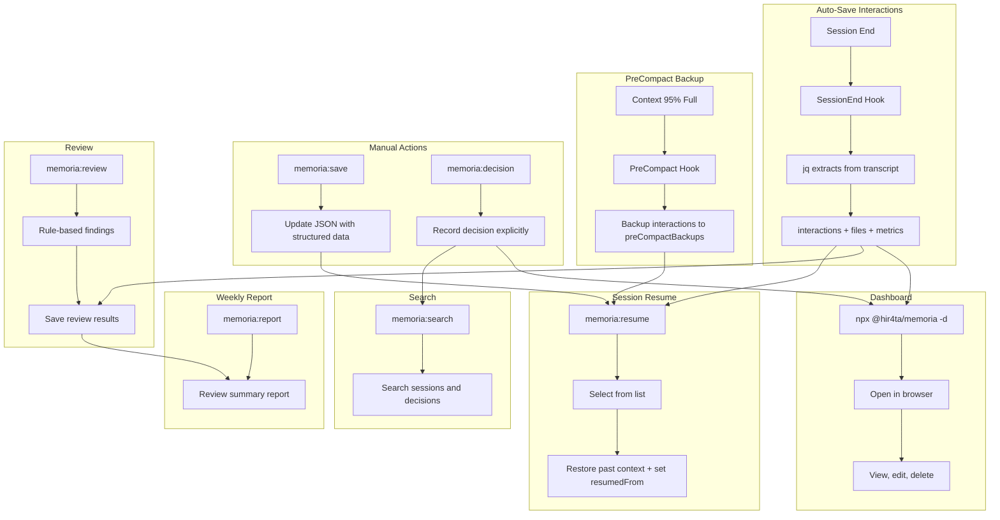

# memoria

Long-term memory plugin for Claude Code

Provides automatic session saving, technical decision recording, and web dashboard management.

## Features

### Core Features
- **Auto-save interactions**: Conversations auto-saved at session end (jq-based, reliable)
- **Backup on PreCompact**: Interactions backed up before Auto-Compact (context 95% full)
- **Manual save**: Create summary and structured data with `/memoria:save`
- **Session Resume**: Resume past sessions with `/memoria:resume` (with chain tracking)
- **Session Suggestion**: Recent 3 sessions shown at session start
- **Technical Decision Recording**: Record decisions with `/memoria:decision`
- **Rule-based Review**: Code review based on `dev-rules.json` / `review-guidelines.json`
- **Weekly Reports**: Auto-generate Markdown reports aggregating review results
- **Web Dashboard**: View and edit sessions, decisions, and rules

### Development Workflow (superpowers-style)
- **Brainstorming**: Socratic questioning + past memory lookup (`/memoria:brainstorm`)
- **Planning**: 2-5 minute task breakdown with TDD enforcement (`/memoria:plan`)
- **TDD**: Strict RED-GREEN-REFACTOR cycle (`/memoria:tdd`)
- **Debugging**: Systematic root cause analysis + error pattern lookup (`/memoria:debug`)
- **Two-stage Review**: Spec compliance + code quality (`/memoria:review --full`)

## Problems Solved

### Common Issues in Claude Code Development

- **Context Loss**: Conversation context is lost on session end or Auto-Compact
- **Opaque Decisions**: "Why did we choose this design?" becomes untraceable
- **Hard to Reuse Knowledge**: Past interactions and decisions are hard to search and reference

### What memoria Enables

- **Auto-save + Resume** enables context continuity across sessions
- **Decision Recording** tracks reasoning and alternatives for later review
- **Search and Dashboard** for quick access to past records
- **Review Feature** for repository-specific code review
- **Weekly Reports** for improving and sharing review practices

### Team Benefits

- `.memoria/` JSON files are **Git-manageable**, enabling team sharing of decisions and session history
- Quickly understand background and context during onboarding or reviews

## Installation

### Prerequisites

- **jq**: Used for JSON processing in hooks

```bash
# macOS
brew install jq

# Ubuntu/Debian
sudo apt-get install jq

# Windows (Chocolatey)
choco install jq

# Windows (Scoop)
scoop install jq

# Windows (winget)
winget install jqlang.jq
```

### Plugin Installation

Run the following in Claude Code:

```bash
/plugin marketplace add hir4ta/memoria-marketplace
/plugin install memoria@memoria-marketplace
```

Restart Claude Code to complete installation.

## Update

Run the following in Claude Code:

```bash
/plugin marketplace update memoria-marketplace
```

Restart Claude Code.

### Enable Auto-Update (Recommended)

1. Run `/plugin`
2. Select Marketplaces tab
3. Select `memoria-marketplace`
4. Enable "Enable auto-update"

This will auto-update on Claude Code startup.

## Usage

### Session Auto-Save

**Interactions are auto-saved** at session end using jq (no Claude dependency). No configuration needed.

**PreCompact** backs up interactions to `preCompactBackups` before Auto-Compact (context 95% full). Summary is NOT auto-created.

**Summary and structured data** are created manually via `/memoria:save`:
- Updates `title`, `tags`, `summary`, `plan`, `discussions`, `errors`, `handoff`, `references` in JSON

### Session Suggestion

At session start, recent 3 sessions are shown:

```
**Recent sessions:**
  1. [abc123] JWT authentication implementation (2026-01-27, main)
  2. [def456] Dashboard UI improvements (2026-01-26, main)
  3. [ghi789] Bug fixes (2026-01-25, main)

Continue from a previous session? Use `/memoria:resume <id>`
```

### Session Chain Tracking

When resuming a session, the chain is tracked:

```
/memoria:resume abc123
  ↓
Current session JSON updated: "resumedFrom": "abc123"
  ↓
Chain: current ← abc123
```

### Commands

| Command | Description |
|---------|-------------|
| `/memoria:resume [id]` | Resume session (show list if ID omitted) |
| `/memoria:save` | Create summary + structured data + extract rules |
| `/memoria:decision "title"` | Record a technical decision |
| `/memoria:search "query"` | Search sessions and decisions |
| `/memoria:review [--staged\|--all\|--diff=branch\|--full]` | Rule-based code review (--full for two-stage) |
| `/memoria:report [--from YYYY-MM-DD --to YYYY-MM-DD]` | Weekly review report |
| `/memoria:brainstorm [topic]` | Design-first Socratic questioning + memory lookup |
| `/memoria:plan [topic]` | Create implementation plan with 2-5 min TDD tasks |
| `/memoria:tdd` | Strict RED-GREEN-REFACTOR development cycle |
| `/memoria:debug` | Systematic debugging with error pattern lookup |

### Recommended Workflow

```
brainstorm → plan → tdd → review
```

1. **brainstorm**: Design with Socratic questions + past memory lookup
2. **plan**: Break into 2-5 minute TDD tasks
3. **tdd**: Implement with RED → GREEN → REFACTOR
4. **review**: Verify against plan (--full) and code quality

### Dashboard

Run in your project directory:

```bash
npx @hir4ta/memoria --dashboard
```

Open <http://localhost:7777> in your browser.

Change port:

```bash
npx @hir4ta/memoria --dashboard --port 8080
```

#### Screens

- **Sessions**: List, view, edit, delete sessions
- **Decisions**: List, create, edit, delete technical decisions
- **Rules**: View and edit dev rules and review guidelines
- **Patterns**: View learned patterns (good patterns, anti-patterns, error solutions)
- **Statistics**: View activity charts and session statistics
- **Graph**: Visualize session connections by shared tags

#### Language Switching

The dashboard supports English and Japanese. Click the language toggle (EN/JA) in the header to switch. The preference is saved to localStorage.

## How It Works



## Data Storage

All data is stored in `.memoria/` directory:

```text
.memoria/
├── tags.json         # Tag master file (93 tags, prevents notation variations)
├── sessions/         # Session history (YYYY/MM)
│   └── YYYY/MM/
│       └── {id}.json # All session data (auto + manual save)
├── decisions/        # Technical decisions (YYYY/MM)
├── rules/            # Dev rules / review guidelines
├── reviews/          # Review results (YYYY/MM)
└── reports/          # Weekly reports (YYYY-MM)
```

Git-manageable. Add to `.gitignore` based on your project needs.

### Session JSON Schema

All session data is stored in a single JSON file:

```json
{
  "id": "abc12345",
  "sessionId": "full-uuid-from-claude-code",
  "createdAt": "2026-01-27T10:00:00Z",
  "endedAt": "2026-01-27T12:00:00Z",
  "title": "JWT authentication implementation",
  "tags": ["auth", "jwt"],
  "context": {
    "branch": "feature/auth",
    "projectDir": "/path/to/project",
    "user": { "name": "tanaka", "email": "tanaka@example.com" }
  },
  "interactions": [
    {
      "id": "int-001",
      "timestamp": "2026-01-27T10:15:00Z",
      "user": "Implement authentication",
      "thinking": "Key insights from thinking process",
      "assistant": "Implemented JWT auth with RS256 signing"
    }
  ],
  "metrics": {
    "userMessages": 5,
    "assistantResponses": 5,
    "thinkingBlocks": 5,
    "toolUsage": [{"name": "Edit", "count": 3}, {"name": "Write", "count": 2}]
  },
  "files": [
    { "path": "src/auth/jwt.ts", "action": "create" }
  ],
  "preCompactBackups": [],
  "resumedFrom": "def45678",
  "status": "complete",

  "summary": {
    "title": "JWT authentication implementation",
    "goal": "Implement JWT-based auth with refresh token support",
    "outcome": "success",
    "description": "Implemented JWT auth with RS256 signing",
    "sessionType": "implementation"
  },

  "plan": {
    "tasks": ["[x] JWT signing method selection", "[x] Middleware implementation", "[ ] Add tests"],
    "remaining": ["Add tests"]
  },

  "discussions": [
    {
      "topic": "Signing algorithm",
      "decision": "Adopt RS256",
      "reasoning": "Security considerations for production",
      "alternatives": ["HS256 (simpler but requires shared secret)"]
    }
  ],

  "errors": [
    {
      "error": "secretOrPrivateKey must be asymmetric",
      "cause": "Using HS256 secret with RS256",
      "solution": "Generate RS256 key pair"
    }
  ],

  "handoff": {
    "stoppedReason": "Test creation postponed to next session",
    "notes": ["vitest configured", "Mock key pair in test/fixtures/"],
    "nextSteps": ["Create jwt.test.ts", "Add E2E tests"]
  },

  "references": [
    { "url": "https://jwt.io/introduction", "title": "JWT Introduction" }
  ]
}
```

### Session Types

The `sessionType` field classifies the session type.

| Type | Description |
|------|-------------|
| `decision` | Decision cycle present (design choices, tech selection) |
| `implementation` | Code changes made |
| `research` | Research, learning, catchup |
| `exploration` | Codebase exploration |
| `discussion` | Discussion, consultation only |
| `debug` | Debugging, investigation |
| `review` | Code review |

### Tags

Tags are selected from `.memoria/tags.json` to prevent notation variations (e.g., "フロント" → "frontend"). The master file contains 93 tags across 11 categories:

- **domain**: frontend, backend, api, db, infra, mobile, cli
- **phase**: feature, bugfix, refactor, test, docs
- **ai**: llm, ai-agent, mcp, rag, vector-db, embedding
- **cloud**: serverless, microservices, edge, wasm
- And more...

## License

MIT
