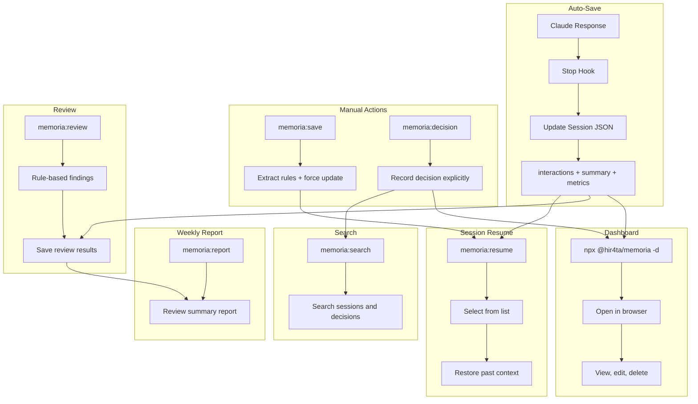

# memoria

Long-term memory plugin for Claude Code

Provides automatic session saving, technical decision recording, and web dashboard management.

## Features

### Core Features
- **Auto-save**: Sessions saved automatically on every Claude response (no configuration needed)
- **Session Resume**: Resume past sessions with `/memoria:resume`
- **Technical Decision Recording**: Record decisions with `/memoria:decision`
- **Rule-based Review**: Code review based on `dev-rules.json` / `review-guidelines.json`
- **Weekly Reports**: Auto-generate Markdown reports aggregating review results
- **Web Dashboard**: View and edit sessions, decisions, and rules

### Development Workflow (superpowers-style)
- **Brainstorming**: Socratic questioning + past memory lookup (`/memoria:brainstorm`)
- **Planning**: 2-5 minute task breakdown with TDD enforcement (`/memoria:plan`)
- **TDD**: Strict RED-GREEN-REFACTOR cycle (`/memoria:tdd`)
- **Debugging**: Systematic root cause analysis + error pattern lookup (`/memoria:debug`)
- **Two-stage Review**: Spec compliance + code quality (`/memoria:review --full`)

## Problems Solved

### Common Issues in Claude Code Development

- **Context Loss**: Conversation context is lost on session end or Auto-Compact
- **Opaque Decisions**: "Why did we choose this design?" becomes untraceable
- **Hard to Reuse Knowledge**: Past interactions and decisions are hard to search and reference

### What memoria Enables

- **Auto-save + Resume** enables context continuity across sessions
- **Decision Recording** tracks reasoning and alternatives for later review
- **Search and Dashboard** for quick access to past records
- **Review Feature** for repository-specific code review
- **Weekly Reports** for improving and sharing review practices

### Team Benefits

- `.memoria/` JSON files are **Git-manageable**, enabling team sharing of decisions and session history
- Quickly understand background and context during onboarding or reviews

## Installation

### Prerequisites

- **jq**: Used for JSON processing in hooks

```bash
# macOS
brew install jq

# Ubuntu/Debian
sudo apt-get install jq

# Windows (Chocolatey)
choco install jq

# Windows (Scoop)
scoop install jq

# Windows (winget)
winget install jqlang.jq
```

### Plugin Installation

Run the following in Claude Code:

```bash
/plugin marketplace add hir4ta/memoria-marketplace
/plugin install memoria@memoria-marketplace
```

Restart Claude Code to complete installation.

## Update

Run the following in Claude Code:

```bash
/plugin marketplace update memoria-marketplace
```

Restart Claude Code.

### Enable Auto-Update (Recommended)

1. Run `/plugin`
2. Select Marketplaces tab
3. Select `memoria-marketplace`
4. Enable "Enable auto-update"

This will auto-update on Claude Code startup.

## Usage

### Session Auto-Save

Sessions are saved **automatically on every Claude response**. No configuration needed.

On each response, Claude updates:
- `interactions`: Chat-style conversation log
- `summary`: Title, goal, outcome, description
- `metrics`: File counts, decision counts, error counts

### Commands

| Command | Description |
|---------|-------------|
| `/memoria:resume [id]` | Resume session (show list if ID omitted) |
| `/memoria:save` | Extract rules from conversation + manual update |
| `/memoria:decision "title"` | Record a technical decision |
| `/memoria:search "query"` | Search sessions and decisions |
| `/memoria:review [--staged\|--all\|--diff=branch\|--full]` | Rule-based code review (--full for two-stage) |
| `/memoria:report [--from YYYY-MM-DD --to YYYY-MM-DD]` | Weekly review report |
| `/memoria:brainstorm [topic]` | Design-first Socratic questioning + memory lookup |
| `/memoria:plan [topic]` | Create implementation plan with 2-5 min TDD tasks |
| `/memoria:tdd` | Strict RED-GREEN-REFACTOR development cycle |
| `/memoria:debug` | Systematic debugging with error pattern lookup |

### Recommended Workflow

```
brainstorm → plan → tdd → review
```

1. **brainstorm**: Design with Socratic questions + past memory lookup
2. **plan**: Break into 2-5 minute TDD tasks
3. **tdd**: Implement with RED → GREEN → REFACTOR
4. **review**: Verify against plan (--full) and code quality

### Dashboard

Run in your project directory:

```bash
npx @hir4ta/memoria --dashboard
```

Open <http://localhost:7777> in your browser.

Change port:

```bash
npx @hir4ta/memoria --dashboard --port 8080
```

#### Screens

- **Sessions**: List, view, edit, delete sessions
- **Decisions**: List, create, edit, delete technical decisions
- **Rules**: View and edit dev rules and review guidelines

## How It Works



## Data Storage

All data is stored in `.memoria/` directory as JSON:

```text
.memoria/
├── tags.json         # Tag master file (93 tags, prevents notation variations)
├── sessions/         # Session history (YYYY/MM)
├── decisions/        # Technical decisions (YYYY/MM)
├── rules/            # Dev rules / review guidelines
├── reviews/          # Review results (YYYY/MM)
└── reports/          # Weekly reports (YYYY-MM)
```

Git-manageable. Add to `.gitignore` based on your project needs.

### Session JSON Schema

```json
{
  "id": "abc12345",
  "sessionId": "full-uuid-from-claude-code",
  "createdAt": "2026-01-27T10:00:00Z",
  "endedAt": "2026-01-27T12:00:00Z",
  "context": {
    "branch": "feature/auth",
    "projectDir": "/path/to/project",
    "user": { "name": "tanaka", "email": "tanaka@example.com" }
  },
  "summary": {
    "title": "JWT authentication implementation",
    "goal": "Implement JWT-based auth with refresh token support",
    "outcome": "success",
    "description": "Implemented JWT auth with RS256 signing"
  },
  "interactions": [
    {
      "timestamp": "2026-01-27T10:15:00Z",
      "user": "Implement authentication",
      "assistant": "Implemented JWT auth with RS256 signing",
      "toolsUsed": ["Read", "Edit", "Write"]
    }
  ],
  "metrics": {
    "filesCreated": 2,
    "filesModified": 1,
    "decisionsCount": 2,
    "errorsEncountered": 1,
    "errorsResolved": 1
  },
  "files": [
    { "path": "src/auth/jwt.ts", "action": "create", "summary": "JWT module" }
  ],
  "decisions": [
    {
      "id": "dec-001",
      "topic": "Auth method",
      "choice": "JWT",
      "alternatives": ["Session Cookie"],
      "reasoning": "Easy auth sharing between microservices",
      "timestamp": "2026-01-27T10:15:00Z"
    }
  ],
  "errors": [
    {
      "id": "err-001",
      "message": "secretOrPrivateKey must be asymmetric",
      "type": "runtime",
      "resolved": true,
      "solution": "Changed to PEM format for RS256"
    }
  ],
  "webLinks": ["https://jwt.io/introduction"],
  "tags": ["auth", "jwt", "backend"],
  "sessionType": "implementation",
  "status": "complete"
}
```

### Session Types

The `sessionType` field classifies the session type.

| Type | Description |
|------|-------------|
| `decision` | Decision cycle present (design choices, tech selection) |
| `implementation` | Code changes made |
| `research` | Research, learning, catchup |
| `exploration` | Codebase exploration |
| `discussion` | Discussion, consultation only |
| `debug` | Debugging, investigation |
| `review` | Code review |

### Tags

Tags are selected from `.memoria/tags.json` to prevent notation variations (e.g., "フロント" → "frontend"). The master file contains 93 tags across 11 categories:

- **domain**: frontend, backend, api, db, infra, mobile, cli
- **phase**: feature, bugfix, refactor, test, docs
- **ai**: llm, ai-agent, mcp, rag, vector-db, embedding
- **cloud**: serverless, microservices, edge, wasm
- And more...

## License

MIT
